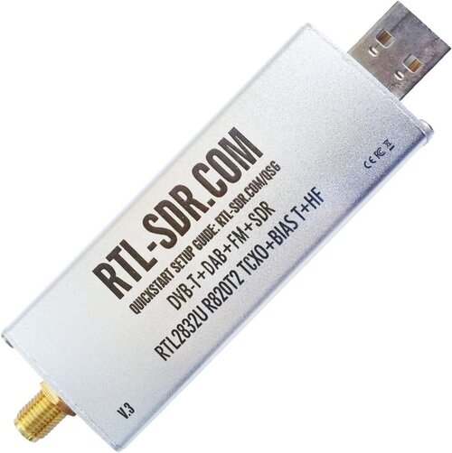
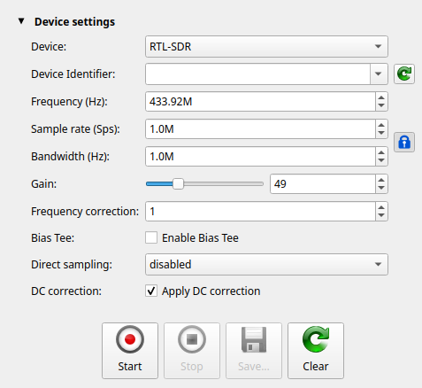
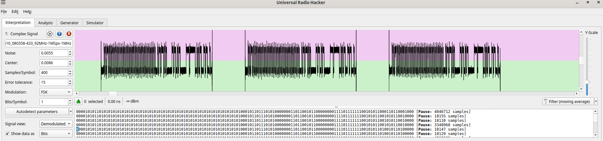
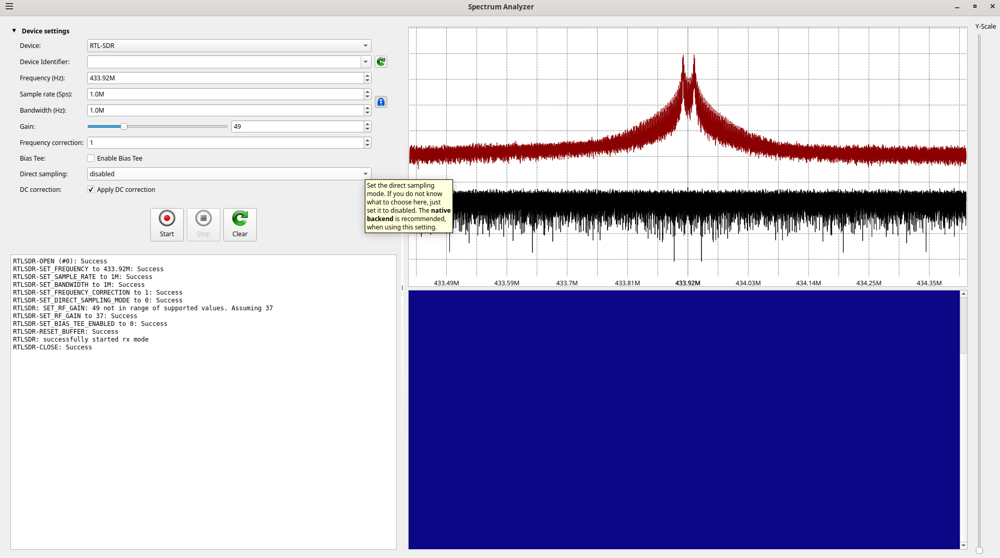

# Quiet Cool RF Remote

This project implements an RF remote control system for Quiet Cool fans using an ESP32 microcontroller and CC1101 RF module. The system can control various fan speeds and modes through RF signals.

## Hardware Requirements

- ESP32 DOIT DevKit V1
- CC1101 RF Module
- Wiring connections as follows:
  ```
  CC1101 Pin -> ESP32 Pin
  GND       -> GND
  VCC       -> 3.3V
  GDO0      -> GPIO13
  CSn       -> GPIO15
  SCK       -> GPIO18
  MOSI      -> GPIO23
  MISO      -> GPIO19
  GDO2      -> GPIO12
  ```

## Software Requirements

- PlatformIO


## Features

- Controls Quiet Cool fan system via RF signals
- Supports multiple fan speeds and timer durations
  - Speed
    - L
    - M
    - H
  - Duration
    - 1
    - 2
    - 4
    - 8
    - 12
    - off
    - on

# Reverse Engineering
I used an RTL-SDR.COM SDR like this:


And for software, I used Universal Radio Haacker.  Here's a recording of all the signals as they progress from H 1 2 4 8 12 ON OFF -> to medium -> low.  It was recorded with these settings



[Download the raw recording](recordings/RTL-SDR-20250510_080358-433_92MHz-1MSps-1MHz.complex16s.gz)





## Modulation
This remote uses FSK modulation at 433.92MHz.  The CC1101 RF module ended up transmitting high, so I reduced the frequency in the code to 433.897 to make it work.  If things don't work, check the actual frequency. 


## Configuration

The system operates at 433.897 MHz and uses FSK modulation. The CC1101 module is configured for:
- Direct mode transmission
- No packet handling
- Raw data mode
- No CRC or preamble

## Building and Uploading

```pio run --target upload```


## License
MIT License

## Contributing

Contributions are welcome! Please feel free to submit a Pull Request.
